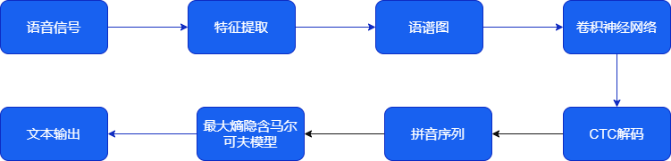
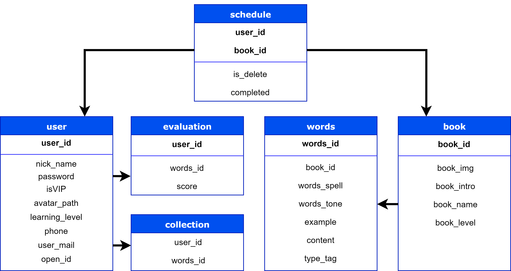
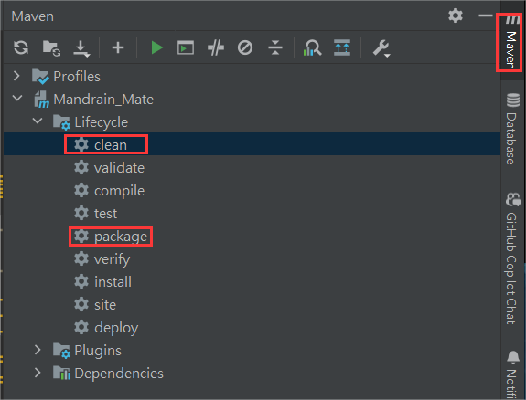
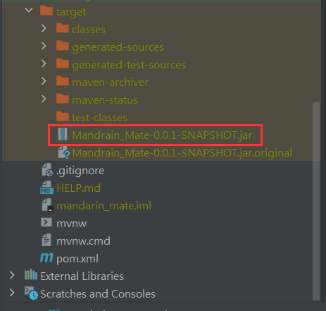
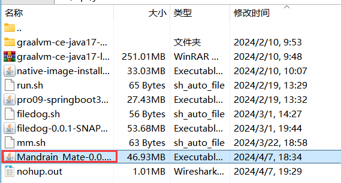

# **语伴**
<div align=center>

</div>

<p align="center">  
Mandarin-Mate 
</p>  

# **项目简介**
&emsp;&emsp;本项目是一款专注于汉语自主学习的软件,以纠正用户发音为核心，通过深度卷积神经网络、语音识别等技术，为用户提供个性化学习建议和丰富的学习资源，实现了一个便捷高效的多功能语言学习平台。项目采用前后端分离开发，后端基于 Spring Boot 框架进行开发，本文主要介绍项目后端开发的相关内容。  
&emsp;&emsp;[前端开发]: [https://github.com/KeepLjx/Mandarin-Mate/tree/main]

# **算法介绍**
&emsp;&emsp;项目的语音识别系统的声学模型采用了深度全卷积神经网络，将语音信号转换成语谱图，输入模型中进行训练，在模型的输出端，通过CTC解码，将声音波形信号直接转录为中文普通话拼音序列，在语言模型上，通过最大熵隐含马尔可夫模型，将拼音序列转换为中文文本。
<div align=center>

</div>
<p align="center">  
算法流程图 
</p>  

# 数据库设计

## **系统功能概要**
* **进度表**：存储用户的学习进度
* **词书表**：存储平台所有可供学习的词书
* **词语表**：存储词语信息
* **用户表**：存储用户登录、收藏、是否为会员等信息，并且与评估表和收藏表关联
* **评估表**：包含用户每次语音输入后系统的得分和词语ID
* **收藏表**：包含用户ID以及用户收藏的单词ID。
## **数据库关系图**
<div align=center>

</div>

## **数据库表结构**
* **user[用户表]**
  
| 字段     | 名称     | 数据类型 | 主键    | 非空     | 默认值  | 
| -------- | -------- | -------- |-------- | -------- | -------- |
| user_id | 用户ID | BIGINT | √ | √ |  | 
| nick_name | 用户昵称| VARCHAR |
| password | 密码 | VARCHAR |
| isVIP | 是否会员 | TINYINT |  | √ |  |
| avatar_path | 头像路径 | VARCHAR |
| learning_level | 学习等级| TINYINT | 
| phone | 用户电话 | VARCHAR |
| user_mail | 用户邮箱 | VARCHAR | 
| open_id | 微信小程序用户ID | VARCHAR |
| create_time | 注册时间 | DETETIME | 


* **schedule[进度表]**
  
| 字段     | 名称     | 数据类型    | 主键   | 非空    |默认值   | 
| -------- | -------- | -------- |-------- | -------- | -------- |
| user_id | 用户ID | BIGINT | √ | √ |
| book_id | 词书ID | BIGINT | √ | √ |
| is_delete | 是否删除 | INT |
| completed | 完成进度 | BIGINT |

* **book[词书表]**
  

| 字段     | 名称     | 数据类型    | 主键   | 非空    |默认值   | 
| -------- | -------- | -------- |-------- | -------- | -------- |
| book_id | 词书ID| BIGINT | √ | √ |   | 
| book_img  | 词书封面 | VARCHAR|   |  |  | 
| book_intro  | 词书简介 | VARCHAR |   |  |  | 
| book_name  | 词书名称 | VARCHAR |   |  |  |
| book_level  | 词书难易等级 | VARCHAR |   |  |  | 


* **words[词语表]**
  

| 字段     | 名称     | 数据类型    | 主键   | 非空    |默认值   | 
| -------- | -------- | -------- |-------- | -------- | -------- |
| words_id | 词语ID | BIGINT | √ | √ |   | 
| book_id | 词书ID | BIGINT | √ | √ |   | 
| words_spell | 拼音拼写 | VARCHAR |
| example | 例句 | VARCHAR |
| content | 词表内容| VARCHAR |  | √ |  |
| type_tag | 词语种类 |VARCHAR |
| voice_path |  | VARCHAR |


* **evaluation[评估表]**
  

| 字段     | 名称     | 数据类型    | 主键   | 非空    |默认值   | 
| -------- | -------- | -------- |-------- | -------- | -------- |
| user_id | 用户ID | BIGINT | √ | √ |   | 
| words_id | 词语ID | BIGINT |
| score | 得分 | BIGINT |


* **collection[收藏表]**
  

| 字段     | 名称     | 数据类型    | 主键   | 非空    |默认值   | 
| -------- | -------- | -------- |-------- | -------- | -------- |
| user_id | 用户ID | BIGINT |   | √ |   |
| words_id | 词语ID | BIGINT |   | √ |   |


# **项目开发**
## **技术栈**
* Java
* Spring
* Framework
* Hutool
* Fastjson
* JWT：使用 JSON Web Token 进行用户身份验证和安全控制。
* MySQL：数据存储
* Lombok：简化 Java 代码，通过注解减少样板代码的编写
* Spring Boot：使用 Spring Boot 构建后端服务，简化了项目配置和开发。
* Redis: 用于在项目中处理缓存和存储数据。
* Aliyun OSS SDK: 阿里云 OSS 对象存储服务的 Java SDK。

## **目录结构和重要文件说明**

* src/main/java/com/mandarin_mate/controller: 包含用户控制器代码。
* src/main/resources: 存放配置文件和静态资源。  
* MandarinMateServerApplication.java: 项目启动类。
* /pom.xml：Maven 项目配置文件，定义了项目的依赖和构建配置。

## **登陆注册相关接口实现**


### **功能实现**
1. 用户注册(register)：通过 @Autowired 和 @Value 注解注入依赖项和配置信息。   
   - 注解：`@PostMapping("register")` 表示该方法处理POST请求，请求路径为 "/register"。  
   - 参数：`@RequestBody UserRegisterFormDTO ` 是一个用于接收用户注册信息的数据传输对象。  
   - 返回：方法返回一个Result对象，其中包含了注册结果。  
   - 实现：调用 `.register(user)`方法进行用户注册操作，并将结果封装为` Result `对象后返回。

3.  用户登录(login)：使用了Spring的注解 `@GetMapping`、`@PostMapping` 和 `@RequestHeader` 进行处理HTTP请求。

    - 注解：`@PostMapping("login")` 表示该方法处理POST请求，请求路径为 "/login"。
    - 参数：`@RequestBody UserLoginDTO userLoginDTO `是用于接收用户登录信息的数据传输对象。
    - 返回：方法返回一个Result对象，其中包含了登录结果。
    - 实现：调用 `.login(userLoginDTO)` 方法进行用户登录操作，并将结果封装为 `Result `对象后返回。

4. 微信登录(weChatLogin)：生成JWT令牌用于用户标识和安全校验.
   
    - 注解：`@PostMapping("/weChatLogin")` 表示该方法处理POST请求，请求路径为 "/weChatLogin"。
    - 参数：
      * 使用了 `@Operation(tags = "微信登录")` 注解，用于标识这是一个微信登录相关的操作。
      * `@RequestBody UserLoginDTO ` 是用于接收用户登录信息的数据传输对象。
    - 返回：方法返回一个`Result`对象，其中包含了登录结果。
    - 实现：
      * 记录日志信息，输出微信登录时用户的代码(code)。
      * 调用 `userService.wxLogin(userLoginDTO) `方法进行微信登录操作，获取对应的用户信息。
      * 生成 JWT 令牌并将用户ID作为声明（claims）存储在令牌中。
      * 构建 UserLoginVO 对象，包含用户的 OpenID、令牌、创建时间等信息。
      * 最终以 `Result.ok(userLoginVO) `的形式返回登录成功的结果。

5. 获取用户信息(getUserInfo)：通过调用 userService 和 mailService 这两个服务的方法实现业务逻辑。

    - 注解：`@GetMapping`  使用 HTTP GET 请求来调用该方法。
    - 参数：` Result getUserInfo(@RequestHeader String token)` 是用于获取用户信息，它接收一个类型为 `String` 的请求头参数名为 `token`。
    - 返回：方法返回一个 `Result `对象，其中包含了包含对用户信息的操作结果。
    - 实现：调用 `UserService.getUserInfo(token)` 方法获取用户信息，并将结果封装为Result对象后返回。

6. 用户头像自定义上传(upload)：用户头像上传时，逻辑包括文件大小限制、格式校验、文件保存等。
  　- 注解：`@PostMapping("/uploadAvatar") `表示该方法处理POST请求，请求路径为 "/uploadAvatar"。
    - 参数：
      *  `@RequestParam("file") MultipartFile file `表示接收用户上传的头像文件。
        
      *  `@RequestHeader("Authorization") String token `表示请求头中的授权令牌。
    - 返回：方法返回一个` Result `对象，其中包含了头像上传结果。
    - 实现：调用` userService.uploadAvatar(file, token) `方法处理用户上传头像操作，并将结果封装为` Result `对象后返回。

7. 邮箱验证码发送(userMail)：使用了` @RestController `和` @RequestMapping `注解标识RESTful API接口。

   userMail() 方法：
    - 目的：生成验证码并向提供的用户邮箱发送电子邮件。
    - 端点：通过对` /user/userMail `发出 GET 请求来访问。
    - 参数：作为请求参数接受一个` userMail `字符串。
    - 功能：
      * 使用` RandomUtil.randomNumbers(6) `生成随机的6位数验证码。
      * 使用` mailService.sendTextMailMessage() `向提供的` userMail `地址发送包含验证码的文本邮件消息。
      * 返回一个` Result `对象作为响应。
   
   
# **项目部署**
* 在Linux环境下部署后端项目。

### 一：编译和打包项目

1. 打开IDEA开发工具，点击Maven，先运行clean清理编译好的可执行文件。
2. 运行package对项目进行重新编译和打包。
3. 复制打包好的.jar文件（jar包）。
<div align=center>

</div>


### 二：将jar包上传至Linux服务器

1. 使用XFTP等工具连接到Linux服务器。
2. 将复制好的jar包保存到`/opt/java/`目录下。
<div align=center>

</div>


### 三：运行项目

1. 进入Linux环境，进入`/opt/java/`路径，确认jar包已经存在。
2. 查看`mm.sh`脚本文件。
3. 运行以下命令启动项目：
   ```
   java -jar /opt/java/Mandarin_Mate-0.0.1-SNAPSHOT.jar &
   ```
<div align=center>

</div>

**项目部署完成**
